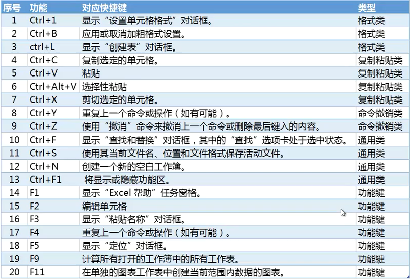
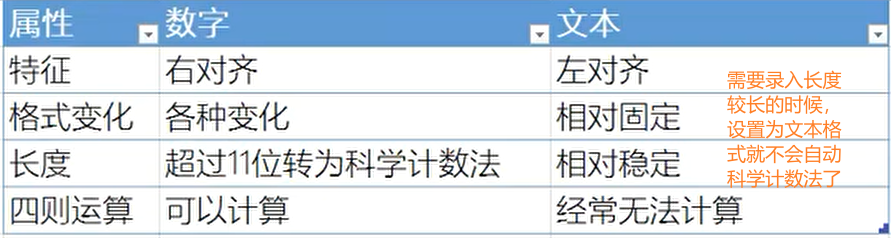
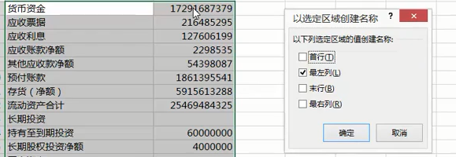
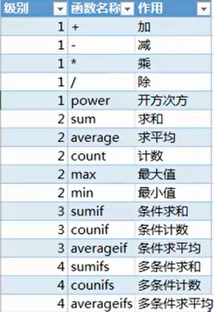
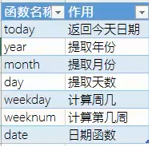
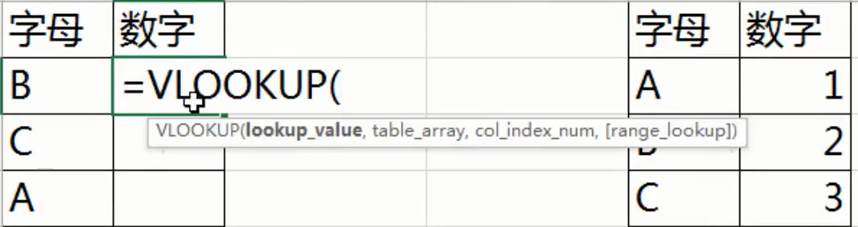

# Excel

## 开始

* 应用商店可以获取很多数据可视化的工具

* 网页打开OfficeOnline可以在线实现office系列的部分操作，例如Excel网页可以实现前端做问卷调查表，后台获取所填信息

* 建议选择微软雅黑light字体(可以在文件-选项-常规 设置默认字体)
* 包含工作表数调整为1
* 将文件保存格式调整为97-2003兼容格式(可选)

### 快捷键

按下ALT显示对应区域的快捷键，可以在工具栏进行快捷键的设置

例：

`Ctrl + Pagedown`切换至下一个表

`Ctrl + 方向键`跳转到完整数据区的边角(左上角右上角等)

`Ctrl + Shift + 方向键`选中一大片完整数据区

`Ctrl + 1`打开单元格格式

 `Alt + 括号内字符`使用括号内的快捷键打开选中指定项目

`Tab` 在不同的选项之间切换

`Shift + Tab` 在不同选项之间切换，与 `Tab` 快捷键是相反顺序的操作

`Shift + Enter` 切换上一个单元格

`Shift` 切换下一个单元格

` F5` 定位，可用于不连续(随机)区域里相同格式数据的选择

`Ctrl + Alt + V` 打开选择性粘贴的选项，选择性粘贴可以实现数值粘贴，格式粘贴，被粘处与剪切板内容相加等操作

`Ctrl + Y` 撤销 

功能快捷键：

其他编辑小技巧：

* 批量搬移

  选中所要移动的单元格后，按住Shift键，鼠标在所选单元格边缘会变成方向箭头，点击拖动到指定的位置就能实现数据的批量搬移

* 批量填充

  选中一篇区域，输入要填充的值，按 `Ctrl + Enter` 就能填充到整个区域，填充的不仅可以是值，也可以是公式 

* 自动调整行列宽度高度

  选中要调整的行列(或者直接两次Ctrl+A选中整张表格)，在列(行)名边缘，光标会变成两个箭头，这时候双击就能实现自动调整列(行)宽(高)

* 快速录入日期和时间

  `Ctrl + ;` 在单元格中填充当前日期(年月日)，或者使用公式` = today()` 同样的效果

  `Ctrl + Shift + ;` 在单元格中填充当前时间(时分)

  使用公式 `=now()` 显示当前日期和时间

  这里使用公式和快捷键的区别是：快捷键生成的时间是值，是不会随着时间变化的，但是公式得到的时间是可以进行计算的，在表刷新的时候会按照公式刷新单元格的数据

* 公式快速填充

  在一个单元格中输入公式，之后双击单元格右下角就能快速将公式进行填充

* 快速查看数据的特征

  在表格下方状态栏右键可以选择显示在状态栏的信息，如数据求和，数据的最大值等

## 获取

### OCR技术

OCR ( Optical Character Recognition，光学字符识别)
指电子设备（例如扫描仪或数码相机）检查纸上打印的字符，通过检测暗、亮的模式确定其形状，然后用字符识别方法将形状翻译成计算机文学的过程

泰比ABBYY和汉王科技两款软件都能进行OCR技术

### 自网站

在Excel中选择 数据-自网站 会打开一个窗口，将包含数据表格的网站网址URL粘贴到这个窗口中，确定后，Excel会建立一个到网站的连接，并自动将此网站中的表格整理出来，可以在左侧窗口选择需要的表格，右侧可以看到缩略视图和网站视图，点击导入后可以看到数据已经被导入到Excel中，之后可以对数据进行其他操作

### 手动录入

* 建议使用 `Tab` 键进行横向单元格中的右移，`Shift + Tab` 键实现左移，`Enter`键实现换行：如果使用Tab碱性右移，使用Enter换行就能让回车后的光标锁定区域变为下一行的第一个项目，而不是下一行的最后一个
* 添加数据有效性（数据验证）减轻工作量：给单元格设置只能输入的内容或格式，例：限制性别只能输入男或女的方法：
  1. 选择需要设置的性别一列
  2. 点击 数据-数据验证-数据验证-设置-允许
  3. 选择 序列
  4. 来源中填选项，选项之间用英文逗号隔开，如`男,女`，确定完成
* `Ctrl + D`将当前单元格的正上方单元格内容填入当前单元格，`Ctrl + R`将当前单元格的正左方单元格内容填入当前单元格，

## 规范

### 数字与文本

注意应该是先设置格式，再填入内容，而不是填入内容后设置格式，否则填入的内容会部分信息丢失，如损失后几位等

**数据表格应该规范化，符合一定规则的表格才能用来数据计算分析，而不只是数据展示的作用**

易犯的错误：

* 合并单元格错误，将多个相同的单元格合并
* 没有序号
* 乱加表头
* 合计出现在表中，合计应该是在前台展示的内容，而不是表格本身的部分
* 不符合数据透视表规范，应该保证同一类的数据在一列，可以使用工具XLTools.net Unpivot Table，在excel的获取加载项，应用商店中可以获得
* 工作表中的0值和空值（不填内容），是不一样的，就比如一组数，其中有一个空值，则计算平均数的时候是不把空值的这个单元算入其内的，而如果此单元格为0，则计算的时候要把此单元格算入
* 数字文本化错误
* 日期格式错误，5月6日可以识别但是5月6号就不能识别
* 单元格非原子化，应该做到单元格原子化，每个单元格中的内容尽量是最小原 子

### 套用表格格式

`Ctrl+L`快捷键，在表格中选中一个单元格，按快捷键选用套用的表格格式，能利用excel内置的表格样式对当前表进行处理。套用表格格式的好处：

* 使表格更加美观
* 更容易添加数据
* 帮助完善字段标题
* 可以做排序筛选查重等功能

应该注意的问题：

* 去除单元格格式的方法：选中区域，单击设计菜单，选中转换为区域，就能取出套用格式

### 函数

函数就是计算规则，格式：`= sum(D1-D12)`

功能：

* 计算

* 为数据透视表做前提

## 计算

### 函数的分类

1. 主干函数

   * 逻辑判断
   * 查找引用

2. 零件函数

   * 时间日期
   * 统计
   * 文本
   * 随机

   

### 单元格(区域)的命名

* 选中一个单元格就会在左上角显示他的名称（例如C2就是C列2行），同样在左上角显示名称的地方可以进行自命名单元格，同样也可以自命名一块区域，在函数中写入此名字就相当于写入此块区域。

* 除了上面的方法，还可以批量命名单元格，具体操作流程：

  

  例第一列为数据的名称，第二列为数据，选中这两列，点击公式菜单中的根据所选内容创建，选在名称在所选区域中的位置，如本例中为最左列，确定完成，之后在函数中就可以直接用左边的名称代表右边的数据

* 其余的名称方面的操作都在公式菜单的名称管理器区域中

### 统计函数

* power开放次方，第一个参数是底数，第二个数是指数，例：`=power(10,5)`就是10的5次方，`=power(10,1/5)`就是10开5此方
* sum求和，打出`sum(` 后选中要计算的区域，然后补充完整，如果不知道函数的参数的格式含义，可以点击左上面的fx标志会给出提示框
* 求平均值时注意有些单元格的值是0还是空，两个概念是不一样的

* **函数在使用复用的时候注意是不是要固定某一列或行，用`$`符号对指定行或列进行固定，例：`$A3就是将A列固定`**

### 日期函数

* weeknum计算的第几周是本年中的第几周

### 文本函数

* 拆
  * left，从左边拆
  * right，从右边拆
  * mid，从中间拆
* 合
  * CONCATENATE
  * &
* 量
  * len，测量文本长度
* 找
  * find，找到要找的文本在指定文本中的位置

### 随机函数

* rand，生成一个0到1之间的数
* randbetween，生成指定范围之间的一个数
* norm.inv，生成一个正态分布的数
* round函数，用在上面的函数外面来调整保留位数
* abs函数，对数据取绝对值

### 判断

* if函数，条件判断，根据判断的值进行操作
* if嵌套能实现C语言中的else if的选择效果，例：`if(F2=5,500,if(F2=4,400,if(F2=3,300,if(F2=2,200,100))))` 就实现了值与F2的值的分级匹配效果（例如分级的工资发放），此例子可以用vlookup实现，更简单一点
* and函数，实现在多个单元格的条件判断的逻辑与的功能
* or函数，实现逻辑或的功能

### 查找引用

#### vlookup函数

应用满足的条件：

* 两张表
* 第一张表与第二张表中有共同的一列，可以是其中内容有不一样的，顺序有不一样的
* 希望将表2中的一列数据，根据共同的这列进行匹配后填充到表1中

参数说明：

1. Lookup_value，共同的列中的一个元素
2. Table_array，要查找的区域，此例子中就是表2的数据区两列，不要把列名也写进去了
3. Col_index_num，要填充到表1的内容是表2中刚选的数据区的第几列
4. Range_lookup，匹配模式，一般选0，精确匹配

hlookup函数，与vlookup相似，唯一差别是vloopup是纵向操作，hlookup是横向操作

#### match函数

返回指定元素在所选区域中的位置序号

可以根据此功能查找出指定字段在第几列，在第几行

#### index函数

返回指定行和列的单元格中的值，常与match函数搭配使用，用match函数获得行和列的值，用index得到此单元格的值。达到选择查询的效果

#### indirect函数

用于制作二级数据验证，用于根据指定单元格内容选择对应的内容填充在另一个单元格中，例子，制作省、市区、县的下拉选择，选中特定的省后，市区的选项自动限制为该省的市区。其中用到了数据验证和indirect函数

## 分析

### 数据透视表

基本使用步骤：

1. 点击要进行分析的区域中的一个单元格
2. 点击插入菜单下的插入数据透视表，新建一张透视表
3. 选择数据透视表字段，到里面将要显示的字段拖动到下面的行或列或值中，拖到行区域中字段就会竖着摆，列一般是用来做二维表，既有行又有列（适用于交叉关系）
4. 数据透视表会对字段进行自动去重

在值字段的设置中可以设置不同的计算分析，例如求和或者最大值之类的

双击内容可以展开内容区

* 罗列什么？汇总什么？

  需要罗列的部分放入行区域中，需要计算的字段放入值区域中。

* 需要罗列的字段是什么关系?什么顺序?
  如果是上下级关系，全部放在行区域，如果是交叉区域就放在列区域，在同一区域要按照顺序摆放。

* 以什么方式汇总?
  合计数、求平均、计数值等等，允许同一字段多次使用。

* 是否需要分页筛选
  利用筛选器。

数据透视表的美化：

* 关闭+-按钮
  +-按钮用于展开和折叠内容，通常只有在数据透视表超过一屏时才会用到，而数据透视表本身为结果导向性的分析窗口，使用此功能的机会较少，应予以关闭
* 分类汇总——不显示分类汇总
  对每一级字段进行汇总，此举会导致表格的碎片化，应选择不显示。
* 总计——对行列禁用总计
  并不是每张表格都需要观察总计数，一般等需要再打开。
* 报表布局——以表格形式显示
  表格布局更加符合中国人的阅读习惯，更易于理解。修改值字段标题

数据透视表编辑功能：

自定义排序顺序

将自定义的排序顺序放在一列中，选中此列-文件-选项-高级-编辑自定义列表-导入，则此时在原表中的升序降序就是按照你指定的顺序进行的

数据切片器

在数据透视表上面的分析菜单下有一个插入切片器，点击后可以选择切出哪个列作为筛选条件，在生成的切片器中选择内容就会将对应的部分选择出来显示

数据透视表的计算：

数据透视表页面的菜单栏有一个“字段、项目和集”菜单，点击后有一个计算项选项，在其中可以进行项（横行之间）之间的四则运算

同样的菜单中还有一个计算字段，用于进行字段（列之间）之间的四则运算计算

## 转化

格式修正

自定义格式中输入0或多个0实际上起的是规定数据位数的作用，比如自定义格式为000，输入的数为1，则存储的为1，显示的为001

自定义格式，0做数字占位符，后面跟上双引号，里面写上要在每个单元格中数据后附加显示的内容，可以用来实现数据加单位显示的作用，实际存储的还是只是数据，这样就能进行计算

自定义格式，@做文本占位符，后面跟上双引号就能在输入的内容中加上双引号中的内容

自定义格式如果没有0或者@作为占位符，则不能将输入到单元格中的内容显示出来

上面的自定义格式的使用方法可以用来将电话号码用`-`符进行分隔等等

表格制作完成后最好使用`Ctrl+L`采用默认的表格样式，这种表格样式能保持标题栏的固定，在下滑表格内容的时候标题能一直固定在数据最上方显示，不用划到最顶端查看了

表格的注释内容可以放在批注里面不用占用单元格的空间

背景颜色的使用：

* 白色字体最好加上颜色表中的倒数第二行的颜色

* 黑色字体最好加上颜色表中的第二行的颜色

建议使用微软雅黑Light字体

表格内容的对比

* 工作簿（excel文件）之间的对比：可以采用视图菜单中的全部重排选项，用不同的排列方式在一个屏幕上显示不同的工作簿，如果点击全部重排的旁边有一个并排查看的按钮，则可以利用这个按钮并排打开多个工作簿，此时在一个工作簿中的滚动会同时将并排的几个工作簿都进行滚动操作

* 工作表（在一个工作簿中包含的多个工作表）之间的对比：将需要对比的多个工作表都在新窗口打开（勾选全部重排中的当前工作簿的活动窗口选项，然后点击新建窗口选项就能将工作表以单独文件的形式打开），相当于打开了多个文件，之后再进行全部重排

* 一个工作表中的多行比较：点击视图中的拆分选项可以将表格拆分成多个部分（窗口），分别显示数据，方便进行对比操作

  

## 输出

### 打印

在文件菜单的打印中能看到打印预览

在工作窗口的最下方有个页面布局的选项，点击后就能看到打印的基本效果，可以添加页眉和页脚，例如页脚可以加上总页数和当前的页数

将不希望打印的列或行进行隐藏就可以不打印出来（不建议）

如果只是希望一部分区域被打印，则可以选中希望打印的部分设置，在页面布局菜单中选择打印区域，设计打印区域，这样就能实现区域的打印

分页预览，在分页预览中可以看到打印的区域，可以用拖动边界线实现改变打印区域的效果，区域中的内容都会打印出来，如果区域过大在一张纸上打出来的字体会更小，可以设置页边距或着横向打印来解决

页面布局中有打印标题的选项，可以将标题加在每页数据的首行

### 图表

选中绘制图标需要的数据区包含标题，点击插入可以插入各式图标，插入后会出现设计和格式两个菜单选项，在设计中可以选择图标的不同样式，同时还可以切换行列

#### 图表的要素

* 主标题概括内容，显示导向性
* 副标题解释图表细节（可以包含单位)
* 图例（超过两个向量时）融入图表中
* 弱化图片背景，网格线、主标题、副标题图表与数据来源左对齐
* 坐标轴上左键右键可以打开坐标轴对应的选项卡对坐标轴进行设置
* 线上的点可以点击后右键对单独的点进行标签的添加

图标上右键可以将制作好的图片保存为模板，以后使用

### 迷你图

并不像精确地展示出数据的变换特征，只是想大概看看数据的特点就可以使用迷你图

点击插入菜单中的折线图或者柱形图、盈亏图图表类型就会创建迷你图，选择使用的数据区域，选择图形的绘制区域就可以根据数据区生成迷你图

### 散点图

适用于两字段的数据显示，横纵坐标轴分别代表一种字段

### 气泡图

适用于三字段的数据显示，横纵坐标轴和气泡的大小分别代表一种字段

所有图表中可以使用组合，用不同的图表类型将不同数量级的数据显示在一个图中

将图表导出到WORD或PPT

建议粘贴的时候选择以图片的形式粘贴

